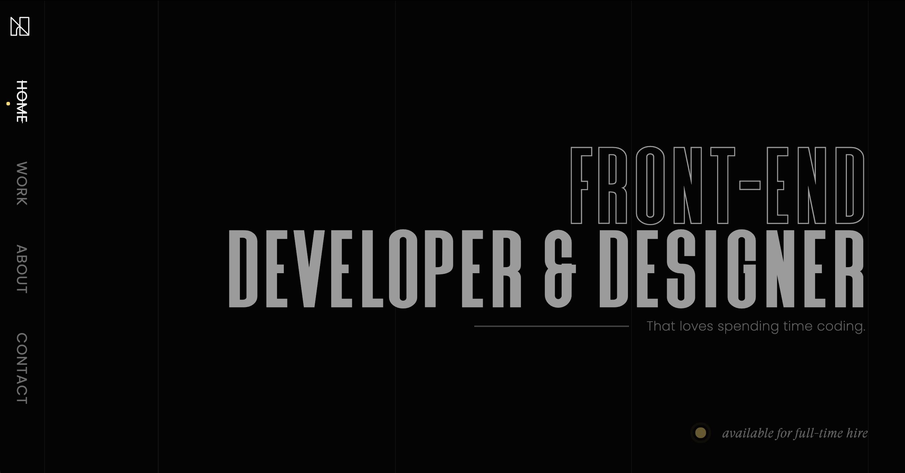

  <h1 align="center">anhnguyen.page</h1>
  <h4 align="center">
    Personal Website
  

    <a href="https://anhnguyen.page" target="_blank">View Demo</a>
        _
    <a href="https://github.com/anguyen0208/anhnguyen.page/issues" target="_blank">Report Bug</a>
        _
    <a href="https://github.com/anguyen0208/anhnguyen.page/issues" target="_blank">Request Feature</a>
  

  </h4>

---

### Built With

Major frameworks that built this project using.
* [NodeJs](https://nodejs.org)
* [Gatsby](https://gatsbyjs.com)
* [MongoBD](https://mongodb.com)
* [Netlify](https://netlify.com)
* [JQuery](https://jquery.com)

### Contact

